**Функционал:** Привязка платежей к объектам расчетов

> **Как** Бухгалтер

> **Я хочу** привязывать платежи к объектам расчетов

**Сценарий:** Привязка платежей к объектам расчетов

	004. И     в таблице "СписокПлатежей" я выбираю текущую строку
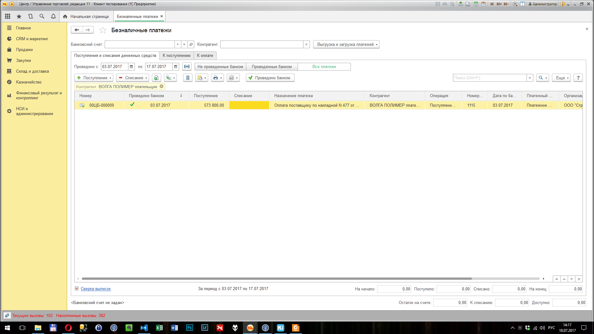

	005. Тогда открылось окно "Поступление безналичных ДС 00ЦБ-000009 от *"
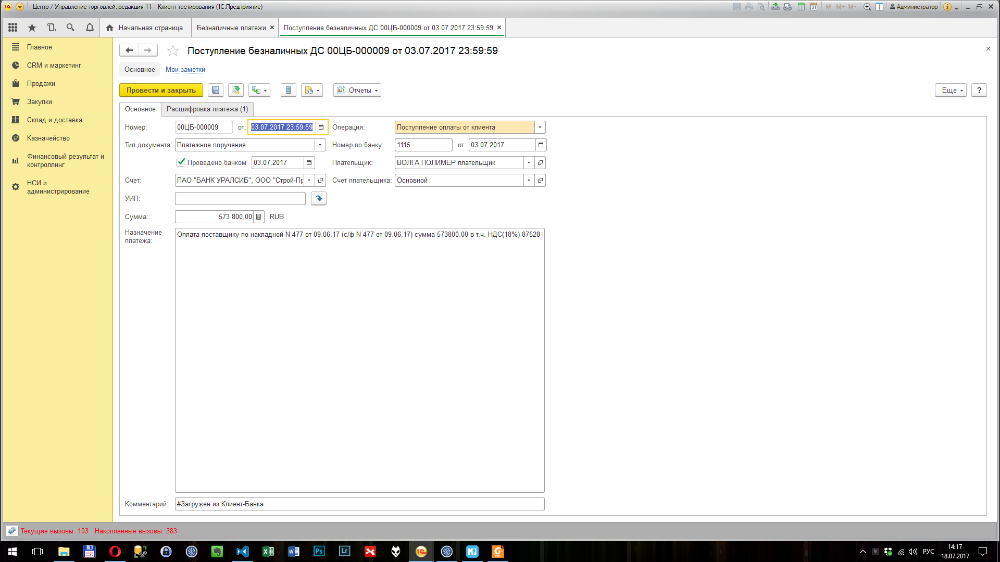

	006. И     я перехожу к закладке "Расшифровка платежа"
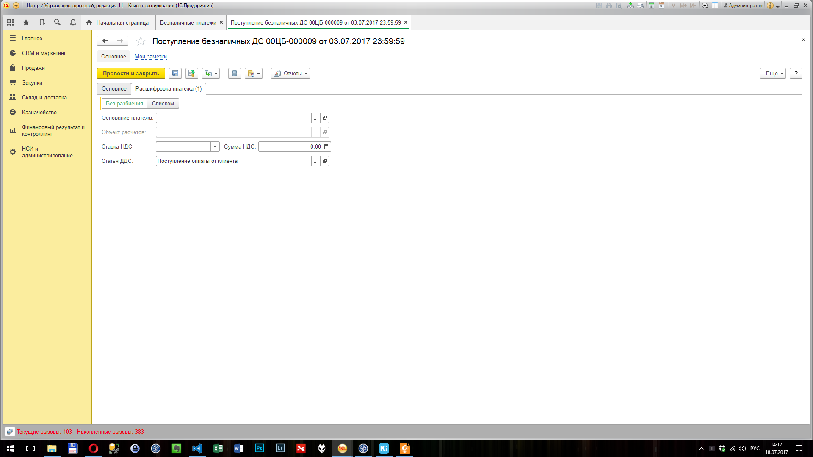

	007. И     я перехожу к закладке "Группа страницы"

	008. И     я меняю значение переключателя "ПереключательРасшифровки" на "Списком"
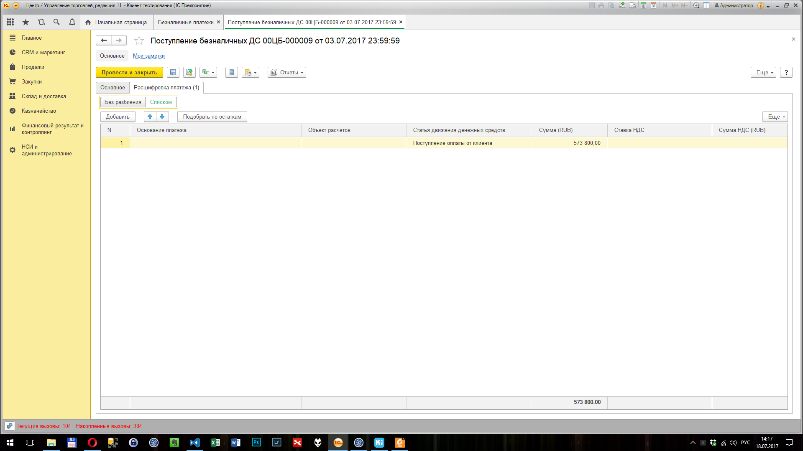

	009. И     в таблице "РасшифровкаПлатежа" я нажимаю на кнопку "Подобрать по остаткам"

	010. Тогда открылось окно "1С:Предприятие"
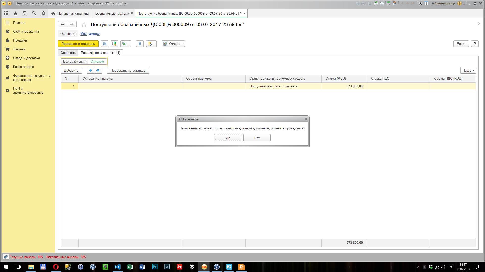

	011. И     я нажимаю на кнопку "Да"

	012. Тогда открылось окно "Подбор по расчетам"
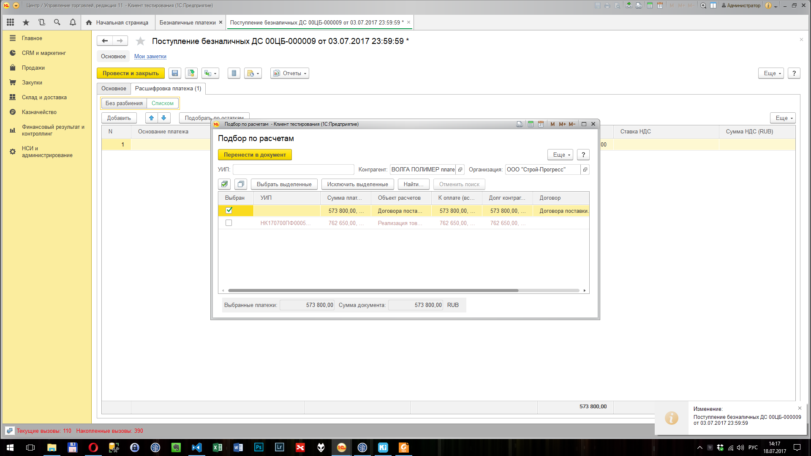

	013. И     я нажимаю на кнопку "Перенести в документ"

	014. Тогда открылось окно "Поступление безналичных ДС 00ЦБ-000009 от * *"
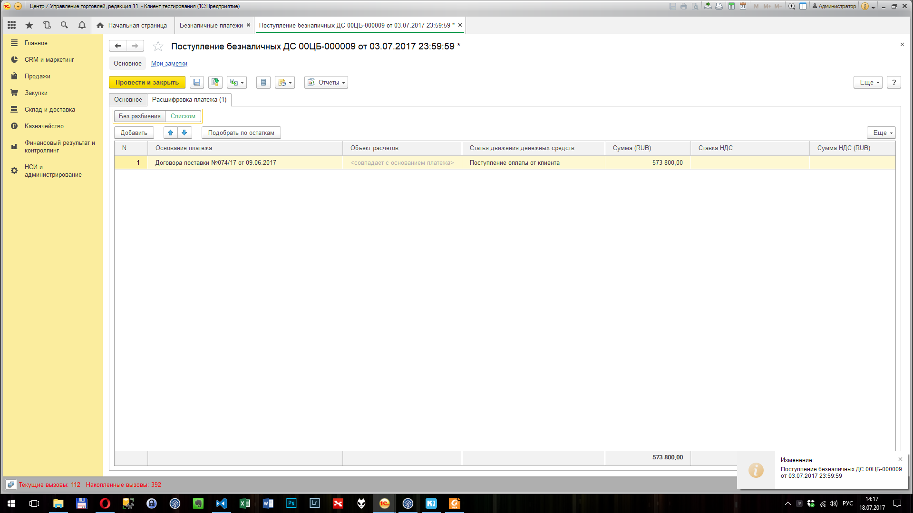

	015. И     я нажимаю на кнопку "Провести"

	016. И     я перехожу к закладке "Основное"
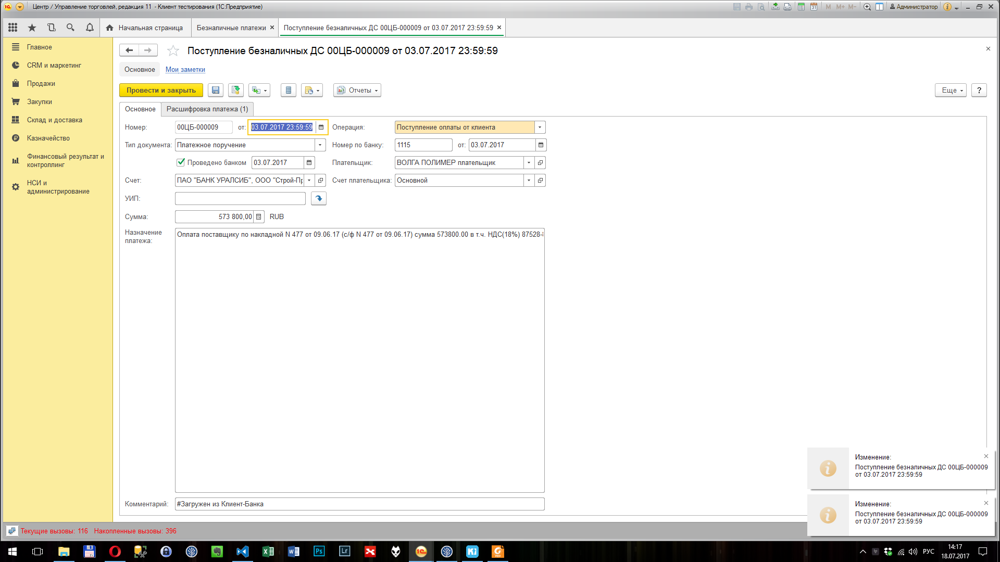

	017. И     я перехожу к закладке "Группа страницы"

	018. И     я нажимаю на кнопку открытия поля "Плательщик"
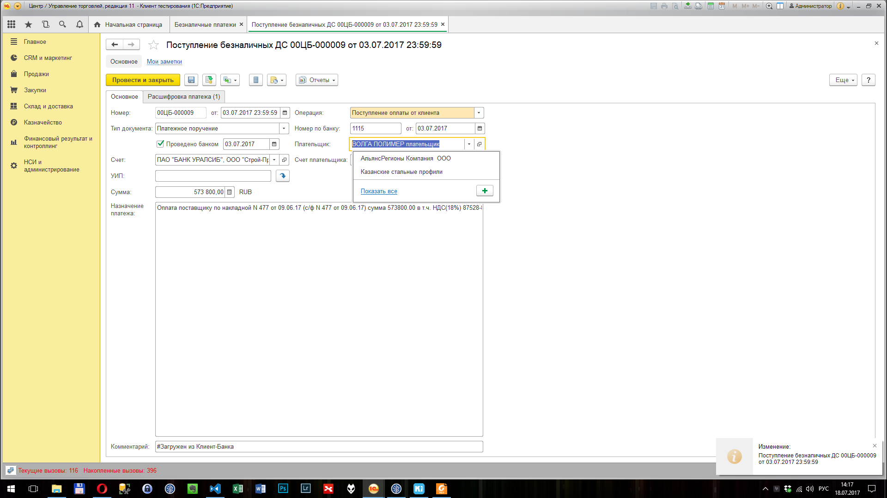

	019. Тогда открылось окно "ВОЛГА ПОЛИМЕР плательщик (Контрагент)"
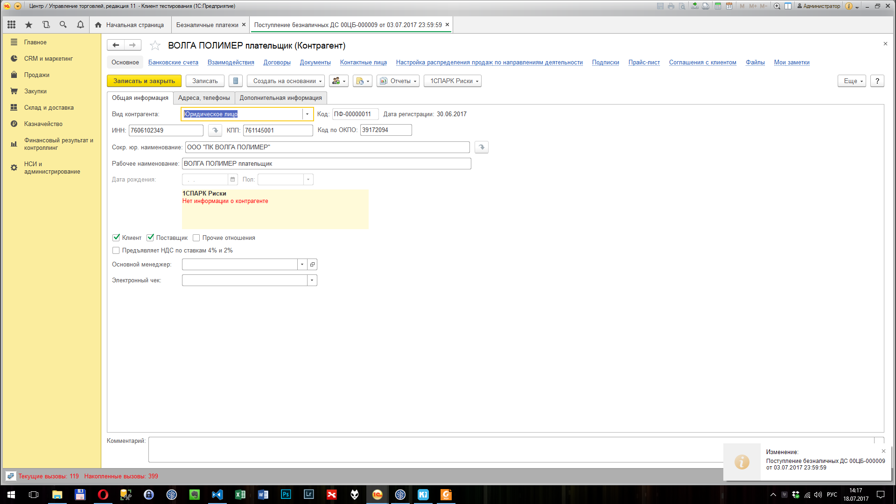

	020. И     я нажимаю на кнопку "Карточка расчетов с клиентами"
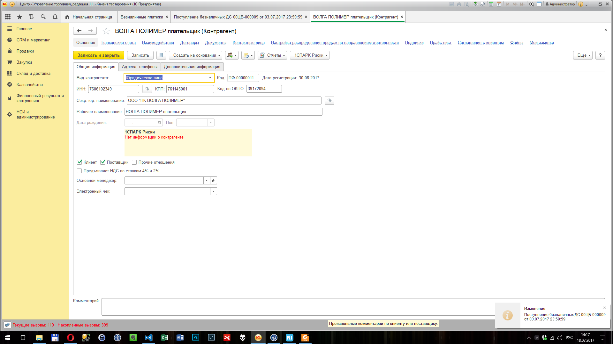

	021. Тогда открылось окно "Карточка расчетов с клиентами"
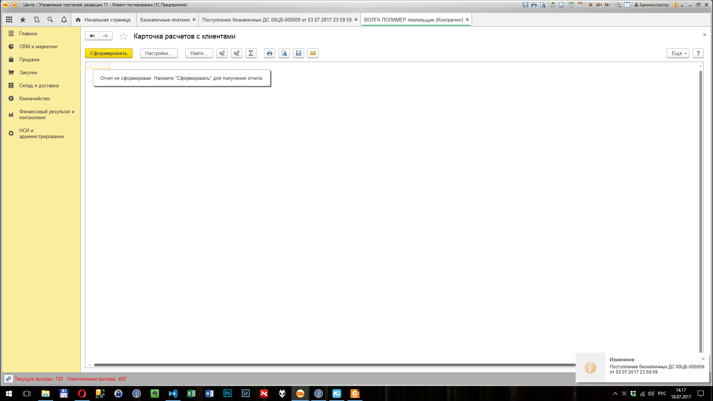

	022. И Пауза 2
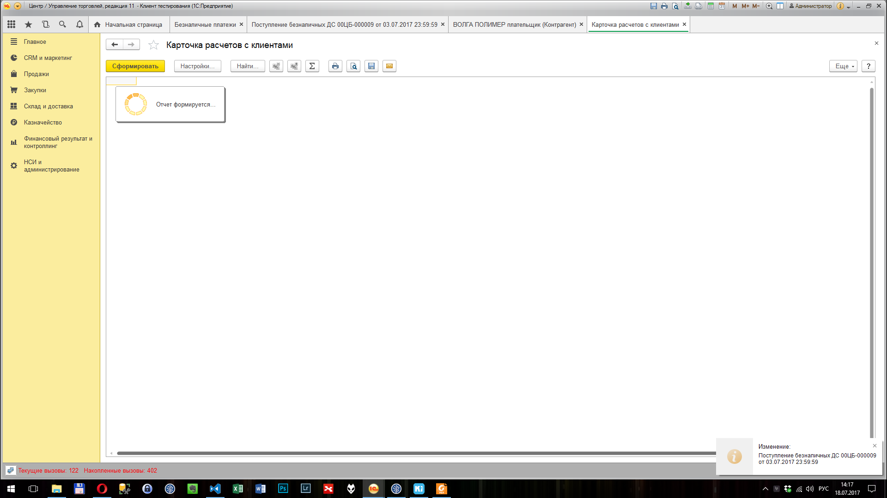

	023. И     у табличного документа с именем "ОтчетТабличныйДокумент" я перехожу к ячейке "R1C1"
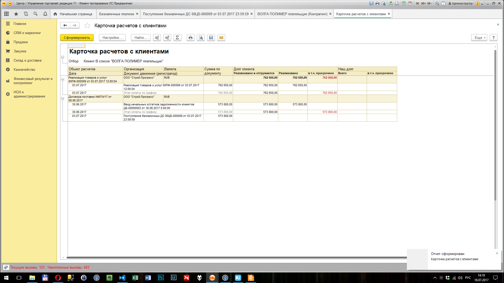
